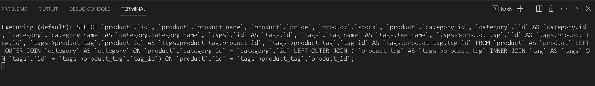

# Challenge 13 Working
 Challenge 13 in which we add the products data in the database by using the command npm start seed then clost the server
 to start the application npm start then check the local host 3001 and check the network tab in the browser the verify the results from the data base. Once seen there check in the insomia.

# User Story
AS A manager at an internet retail company
I WANT a back end for my e-commerce website that uses the latest technologies
SO THAT my company can compete with other e-commerce companies

# Acceptance Criteria
GIVEN a functional Express.js API
WHEN I add my database name, MySQL username, and MySQL password to an environment variable file
THEN I am able to connect to a database using Sequelize
WHEN I enter schema and seed commands
THEN a development database is created and is seeded with test data
WHEN I enter the command to invoke the application
THEN my server is started and the Sequelize models are synced to the MySQL database
WHEN I open API GET routes in Insomnia for categories, products, or tags
THEN the data for each of these routes is displayed in a formatted JSON
WHEN I test API POST, PUT, and DELETE routes in Insomnia
THEN I am able to successfully create, update, and delete data in my database

# Instructions
npm start seed
npm start
check insomia results on https://localhost:3001

# ScreenShots

# Video Link

# Contact
feel free to contact me for any questions syedali05125569@gmail.com
